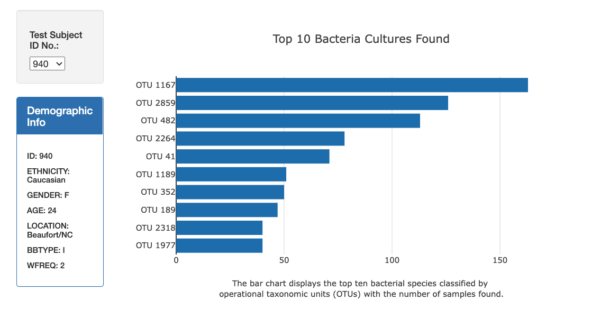
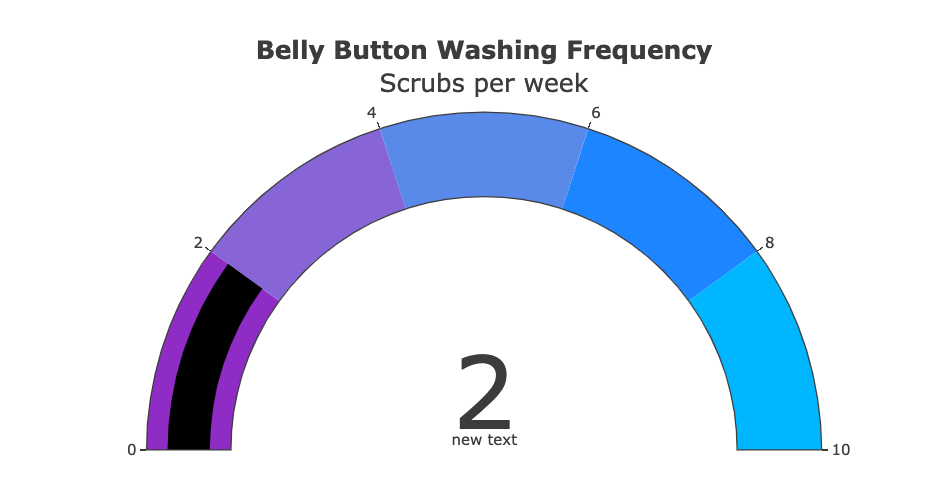
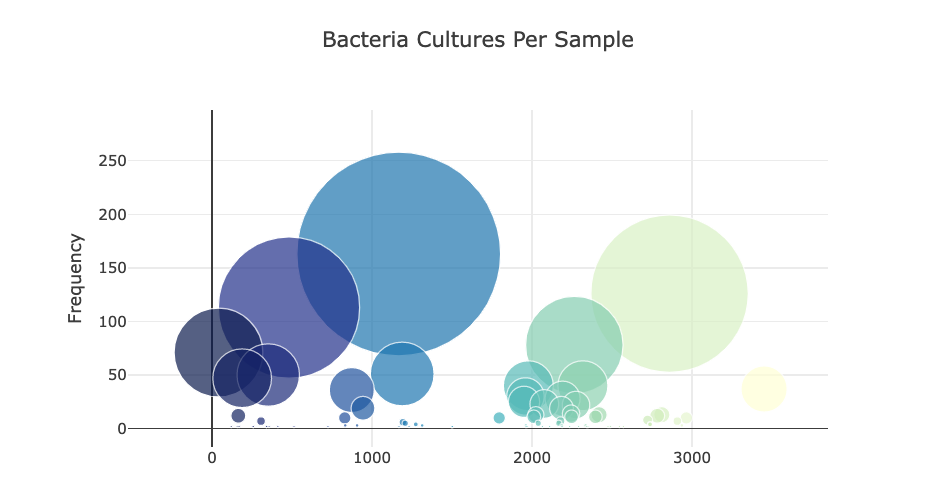

# Biodiversity 
Vizualizing biodiversity

## Overview 

Using JavaScript, Plotly, and D3.js to create an interactive dashboard to display the top 10 bacterial species by selecting the individual’s ID number from a pull-down menu.  The data is also presented as a bubble chart as well as a gauge chart.   

## Results

** View the dashboard here:**  https://halesoysters.github.io/halesoysters.1.github.io/

 

 

 

The biggest challenge with this project was creating all the variables to hold the sample, labels, and data and calling them correctly in the Plotly charts.  
